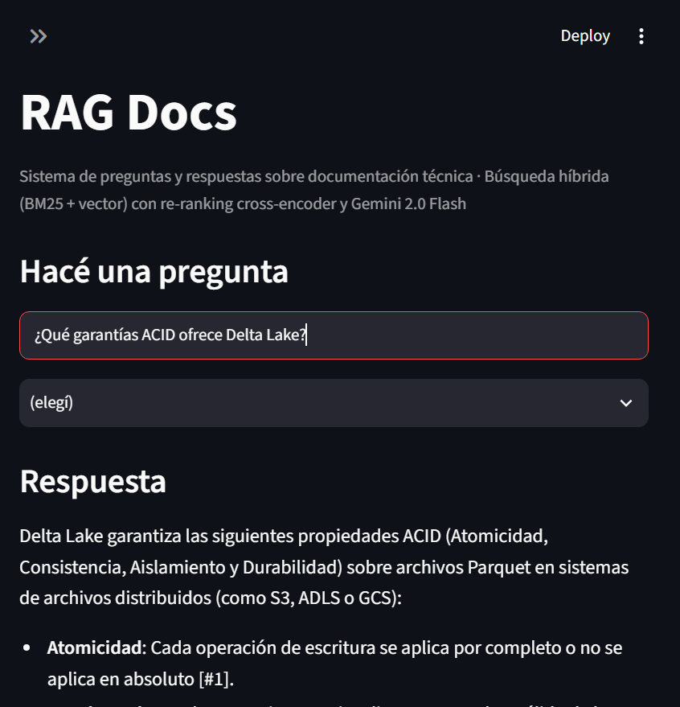

# RAG Docs — Sistema de Preguntas y Respuestas sobre Documentación Técnica

> MVP **evaluado**: un sistema RAG que ingiere documentación técnica, la indexa con búsqueda híbrida, y responde preguntas con citas a las fuentes. **Costo de inferencia: USD 0** usando Google Gemini, BGE-M3 y Chroma (dev) / Databricks Vector Search (opcional). No es un producto de plataforma.




---

## ¿Por qué este proyecto?

MVP evaluado sobre documentación técnica con búsqueda híbrida, re-ranking opt-in y evaluación light. Demuestra:

- Diseño de pipelines de ingestión (transferible desde data engineering)
- **Búsqueda híbrida** (BM25 + vector denso) con RRF; cross-encoder rerank **opt-in** (`ENABLE_RERANK`, default off)
- **Ablation study** con métricas honestas (n chico; hybrid no “gana” en este corpus)
- **Evaluación sistemática** (20 Q&A con `expected_source`; camino soportado: `evaluate_light.py`; RAGAS full **no soportado**)
- **5 ADRs** documentando decisiones técnicas
- **CI** con GitHub Actions (lint + mypy + tests)
- **Backend**: Chroma (local) y Databricks Vector Search (opcional). **No hay pgvector** en este repo
- **Costo de inferencia: USD 0** (Gemini Flash-Lite free tier)
- **Langfuse no implementado**

Para más detalles sobre arquitectura, evaluación, decisiones técnicas y deploy, ver:
- [`docs/ARCHITECTURE.md`](docs/ARCHITECTURE.md) — decisiones técnicas y trade-offs
- [`docs/EVALUATION.md`](docs/EVALUATION.md) — cómo interpretar las métricas
- [`docs/DEPLOY_DATABRICKS.md`](docs/DEPLOY_DATABRICKS.md) — setup Free Edition, gotchas y cleanup
- [`docs/adr/`](docs/adr/README.md) — 5 Architecture Decision Records

---

## Arquitectura

```
┌──────────────┐
│  Documentos  │  (PDF, MD, HTML, TXT)
│  demo: 8 MD  │
└──────┬───────┘
       │ 1. Ingesta (loaders por formato)
       ▼
┌──────────────┐
│   Chunking   │  tiktoken, sliding window 512 tokens / overlap 64
│   + Metadata │  source, filename, chunk_index, page, etc.
└──────┬───────┘
       │ 2. Embedding (BGE-M3, normalizado)
       ▼
┌──────────────┐
│  Vector DB   │  Chroma (cosine) + BM25 index (rank-bm25)
│  + BM25 idx  │  Búsqueda híbrida con RRF (k=60)
└──────┬───────┘
       │ 3. Query
       ▼
┌──────────────┐
│  Re-ranker   │  Opt-in (ENABLE_RERANK). BGE-reranker-base top-20 → top-5
└──────┬───────┘
       │ 4. Generation
       ▼
┌──────────────┐
│  LLM (Gemini │  Gemini Flash-Lite (gemini-flash-lite-latest)
│  Flash-Lite) │  + citas [#N] obligatorias
└──────┬───────┘
       │ 5. Response
       ▼
   {answer, citations, scores, latency_ms, model}
```

---

## Tech Stack (todo gratis)

| Componente | Herramienta | Costo |
|---|---|---|
| **LLM** | Google Gemini Flash-Lite (`gemini-flash-lite-latest`, free tier) | $0 |
| **Embeddings** | HuggingFace `BAAI/bge-m3` (local, 1024-dim, multilingüe) | $0 |
| **Re-ranker** | HuggingFace `BAAI/bge-reranker-base` (local) | $0 |
| **Vector DB** | Chroma (local) / Databricks Vector Search (opcional) | $0 |
| **Keyword search** | rank-bm25 (local, persistido a disco) | $0 |
| **Backend** | FastAPI + Uvicorn | $0 |
| **Frontend demo** | Streamlit | $0 |
| **Chunking** | tiktoken (cl100k_base) | $0 |
| **Evaluation** | `evaluate_light.py` (LLM-as-judge); full RAGAS no soportado | $0 |
| **Observability** | Langfuse **no implementado** (`trace_id` siempre `None`) | $0 |
| **Local stack** | Docker + Docker Compose (API + Streamlit) | $0 |

**Costo total para construir + demostrar: USD 0**

---

## Quick Start (10 minutos al primer query)

### 1. Setup

**Unix / macOS**

```bash
cd rag-docs

python -m venv venv
source venv/bin/activate

pip install -r requirements.txt

# Configurar API key de Gemini (gratis)
# Obtené tu key en https://aistudio.google.com/app/apikey
cp .env.example .env
# Editá .env y poné tu GOOGLE_API_KEY
```

**Windows (PowerShell)**

```powershell
cd rag-docs

python -m venv venv
.\venv\Scripts\Activate.ps1

pip install -r requirements.txt

Copy-Item .env.example .env
# Editá .env y poné tu GOOGLE_API_KEY
```

### 2. Ingerir documentos

El corpus de demo está en `data/sample/` (markdowns de Spark / Delta / Vector Search).

```bash
# Ingerir (rebuild=True si querés empezar de cero)
python -m scripts.ingest --source ./data/sample --collection spark_docs
```

Vas a ver: chunking → embedding → indexing. Al terminar, el script imprime el recuento **real** de chunks, documentos y tiempo de esa corrida (no un número fijo de ejemplo).

### 3. Levantar la API

```bash
uvicorn app.main:app --reload --port 8000

# Probar:
curl -X POST http://localhost:8000/query \
  -H "Content-Type: application/json" \
  -d '{"question": "¿Cómo funciona la arquitectura Medallion en Databricks?"}'
```

Respuesta esperada:
```json
{
  "answer": "La arquitectura Medallion es un patrón de diseño de datos...",
  "citations": [{"source": "...", "score": 0.92, "text_snippet": "..."}],
  "latency_ms": 1240,
  "model": "gemini-flash-lite-latest",
  "collection": "spark_docs",
  "chunks_retrieved": 5
}
```

### 4. UI demo

```bash
# En otra terminal, con el venv activado
streamlit run app/streamlit_app.py

# Abrí http://localhost:8501
```

### Docker Compose (local)

```bash
# Local: API en :8000, Streamlit en :8501
# Requiere .env con GOOGLE_API_KEY
docker compose up
```

### 5. (Opcional) Evaluar (camino soportado: light)

```bash
# Generar un set de Q&A desde la colección (usa Gemini)
python -m scripts.generate_eval_set --collection spark_docs --output data/eval/qa_set.json --num-questions 30

# O usar el template y editarlo a mano (incluye expected_source)
cp data/eval/qa_set_template.json data/eval/qa_set.json

# Camino soportado (1 LLM call/Q). Full RAGAS (`scripts/evaluate.py`) no está soportado aquí.
python -m scripts.evaluate_light

# Ablation Hit@K / MRR (usa expected_source, no heurística de texto)
python scripts.ablation.py --eval-set data/eval/qa_set.json
```

### 6. (Opcional) Correr los tests

```bash
pytest tests/ -v
```

---

## Estructura del proyecto

```
rag-docs/
├── README.md                      # Este archivo
├── requirements.txt               # Dependencias
├── pyproject.toml                 # ruff + mypy + pytest config
├── .env.example                   # Template de variables de entorno
├── .gitignore
├── LICENSE                        # MIT
├── Dockerfile                     # Para deploy
├── docker-compose.yml             # API + Streamlit
├── .github/
│   └── workflows/ci.yml           # GitHub Actions: lint + mypy + tests
│
├── app/                           # Aplicación principal
│   ├── __init__.py
│   ├── main.py                    # FastAPI app
│   ├── streamlit_app.py           # UI demo
│   ├── config.py                  # Configuración centralizada (Pydantic Settings)
│   │
│   ├── core/                      # Lógica de negocio
│   │   ├── chunker.py             # Sliding window con tiktoken + metadata
│   │   ├── embedder.py            # BGE-M3 wrapper (singleton)
│   │   ├── vector_store.py        # Chroma wrapper
│   │   ├── vector_store_databricks.py  # Databricks Vector Search adapter
│   │   ├── bm25_store.py          # rank-bm25 wrapper (persistido)
│   │   ├── hybrid_search.py       # Búsqueda híbrida con RRF
│   │   ├── reranker.py            # Cross-encoder re-ranking
│   │   ├── generator.py           # Gemini wrapper con prompt estructurado
│   │   ├── store_factory.py       # Vendor-agnostic store selector
│   │   └── pipeline.py            # Orquestación end-to-end
│   │
│   ├── models/                    # Schemas Pydantic
│   │   ├── query.py               # QueryRequest, IngestRequest
│   │   └── response.py            # QueryResponse, Citation, HealthResponse
│   │
│   └── observability/             # Paquete vacío; Langfuse no implementado
│       └── __init__.py
│
├── scripts/                       # Scripts CLI
│   ├── ingest.py                  # Ingesta de documentos (PDF/MD/HTML/TXT)
│   ├── generate_eval_set.py       # Generar Q&A set con Gemini o desde template
│   ├── evaluate.py                # Full RAGAS (no soportado; disclaimer en el script)
│   ├── evaluate_light.py          # Camino soportado (1 LLM call/Q)
│   ├── ablation.py                # vector vs hybrid vs hybrid+rerank
│   ├── smoke_test_databricks.py   # End-to-end test contra Databricks
│   └── cleanup_databricks.py      # Drop endpoint + table + catalog
│
├── data/                          # Data local (no commitear — ver .gitignore)
│   ├── raw/                       # PDFs/MDs originales
│   ├── chroma/                    # Vector DB local
│   ├── processed/                 # (reservado)
│   └── eval/
│       ├── qa_set.json            # 20 Q&A con ground truth
│       ├── qa_set_template.json   # 5 Q&A starter
│       └── results.json           # (generado por evaluate.py)
│
├── tests/                         # Tests (pytest, 11 tests, ~9s)
│   ├── test_chunker.py
│   ├── test_hybrid_search.py
│   └── test_pipeline_query.py
│
└── docs/                          # Documentación
    ├── ARCHITECTURE.md            # Decisiones técnicas detalladas
    ├── EVALUATION.md              # Cómo interpretar métricas
    ├── DEPLOY_DATABRICKS.md       # Setup Free Edition, gotchas y cleanup
    ├── adr/                       # Architecture Decision Records
    │   ├── README.md
    │   ├── 0001-bge-m3-embedding-model.md
    │   ├── 0002-hybrid-search-bm25-vector.md
    │   ├── 0003-rerank-cross-encoder.md
    │   ├── 0004-vector-store-abstraction.md
    │   └── 0005-gemini-flash-lite.md
    └── img/
        └── streamlit-demo.jpg
```

---

## Features implementadas

### Core (MVP) — listo y funcionando
- [x] Ingesta de PDFs, Markdown, HTML, TXT
- [x] Chunking sliding-window con tiktoken (512/64) + metadata rica
- [x] Embeddings locales con BGE-M3 (multilingüe, 1024-dim)
- [x] Búsqueda vector con Chroma (cosine, persistent)
- [x] Búsqueda BM25 con rank-bm25 (persistido a disco)
- [x] Búsqueda híbrida con RRF (k=60)
- [x] Re-ranking opt-in con cross-encoder BGE-reranker-base (default off)
- [x] Generación con Gemini Flash-Lite (`gemini-flash-lite-latest`) + prompt estructurado
- [x] Citas a las fuentes con score
- [x] API REST con FastAPI (health, collections, query, ingest)
- [x] UI demo con Streamlit
- [x] Evaluación light (faithfulness / relevancy; precision/recall no se venden como logro)
- [x] Auto-generación de Q&A con Gemini para eval
- [x] Tests unitarios (chunker, hybrid search, pipeline)
- [x] Dockerfile + docker-compose
- [x] Documentación: ARCHITECTURE, EVALUATION

---

## Métricas de evaluación (históricas, corpus chico)

Números de una corrida sobre el corpus de demo (`data/sample/`, 8 markdowns, ~18–247 chunks según ingest). **No generalizan** a un corpus de 50–100 documentos.

### Ablation (Hit@K / MRR)

Las 3 configuraciones sobre 20 Q&A con `expected_source`. En este n chico, **hybrid ≈ vector** (mismos Hit@K / MRR). Eso no implica que hybrid “gane”.

| Configuración | Hit@1 | Hit@3 | Hit@5 | MRR | Latencia |
|---------------|-------|-------|-------|-----|----------|
| **vector-only** (BGE-M3) | 0.900 | 0.900 | 0.900 | 0.900 | 88 ms |
| **hybrid** (BM25 + vector, RRF) | 0.900 | 0.900 | 0.900 | 0.900 | 77 ms |
| **hybrid + rerank** (BGE-reranker) | 0.850 | 0.900 | 0.900 | 0.867 | 5086 ms |

> En esta corrida el rerank bajó Hit@1 y sumó ~58× latencia. Eso es un dato de este corpus, no un ranking de arquitecturas. Ver [`docs/adr/0003-rerank-cross-encoder.md`](docs/adr/0003-rerank-cross-encoder.md).

Para reproducir: `python scripts/ablation.py --eval-set data/eval/qa_set.json`

### Generación (`evaluate_light.py`)

Camino soportado: LLM-as-judge, 1 call por pregunta. Full RAGAS (`scripts/evaluate.py`) **no está soportado** (conflictos langchain/datasets).

| Métrica | Valor (histórico) | Notas |
|---------|-------------------|-------|
| **Faithfulness** | 0.87 | LLM-as-judge; n=20 |
| **Answer Relevancy** | 1.00 | LLM-as-judge; n=20 |
| **Context Precision** | 0.40 | No se interpreta como logro; n chico + judge estricto |
| **Context Recall** | 0.59 | Idem; no comparar contra “target de producción” |

Precision y recall aquí son definiciones de un judge con n pequeño, no evidencia de calidad de retrieval.

Para reproducir: `python scripts.evaluate_light.py`

Cómo leer las métricas: [`docs/EVALUATION.md`](docs/EVALUATION.md).

---

## Recursos y referencias

- [RAGAS documentation](https://docs.ragas.io/)
- [BGE embeddings paper](https://arxiv.org/abs/2402.03216)
- [Reciprocal Rank Fusion paper](https://plg.uwaterloo.ca/~gvcormac/cormacksigir09-rrf.pdf)
- [Google Gemini free tier](https://aistudio.google.com/app/apikey)
- [Chroma documentation](https://docs.trychroma.com/)

---

## Licencia

MIT — usá esto como base, modificalo, hacé lo que quieras. Ver `LICENSE`.
