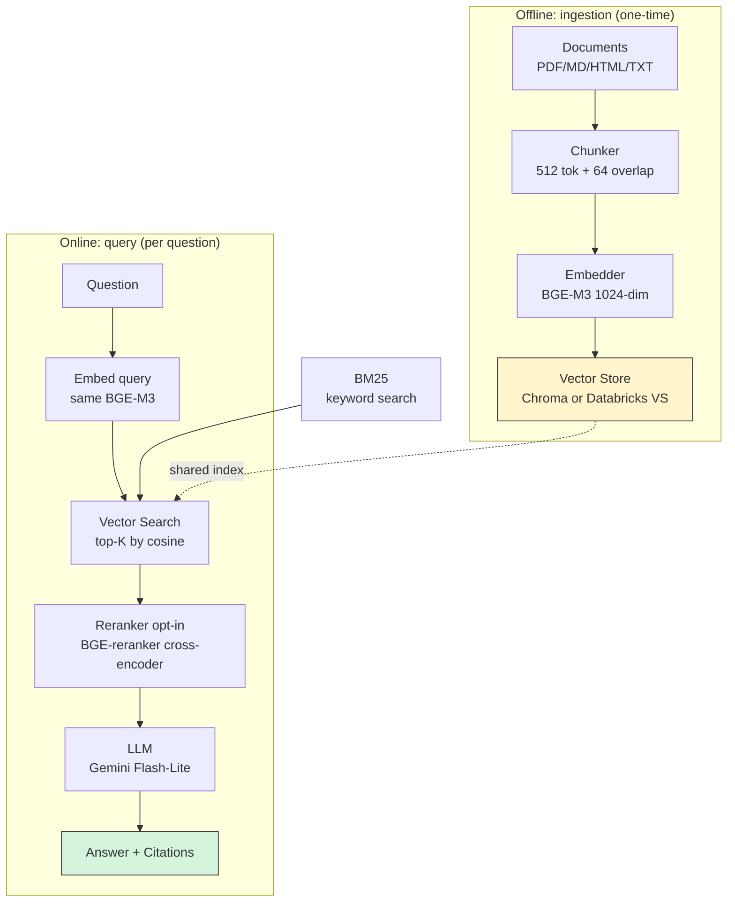

# RAG Docs — Architecture Diagram

A visual overview of the system. Two parts:
1. **High-level**: what RAG is, in 30 seconds
2. **Detailed**: how the actual project implements each step

## High-level: two phases, one shared store

```
                          RAG: dos fases, un store
                          ========================

  OFFLINE (una vez)                   ONLINE (cada pregunta)
  =================                   ====================

  Doc → Chunk → Embed ──┐              ┌──▶  Vector Search ──┐
                        │              │                     │
                        ├──────────────┤   hybrid con BM25   ├──▶ Rerank?──▶ LLM ──▶ Answer
                        │              │                     │    (cross-    (Gemini    + Citations
                        │              └──▶  BM25 keyword ──┘    encoder)    Flash)
                        ▼
                  [Vector Store]
                  Chroma | Databricks VS
```

**Key insight:** los mismos datos (chunks + embeddings) se usan para escribir (offline) y para buscar (online). La pipeline se monta sobre ese store compartido.

## Detailed: each box

```
                  RAG: Retrieval-Augmented Generation
                  =====================================

  ┌──────────────────── OFFLINE (one-time) ─────────────────────┐
  │                                                             │
  │   ┌──────────┐   ┌──────────┐   ┌──────────┐               │
  │   │Documents │──▶│ Chunker  │──▶│ Embedder │               │
  │   │PDF/MD/   │   │ 512 tok  │   │ BGE-M3   │               │
  │   │HTML/TXT  │   │ 64 over- │   │ 1024-dim │               │
  │   │          │   │ lap      │   │ per chunk│               │
  │   └──────────┘   └──────────┘   └────┬─────┘               │
  │                                      │                      │
  │                                      ▼                      │
  │                          ┌──────────────────────┐           │
  │                          │    Vector Store      │           │
  │                          │                      │           │
  │                          │  dev: Chroma         │           │
  │                          │       (in-process)   │           │
  │                          │                      │           │
  │                          │  prod: Databricks    │           │
  │                          │       Vector Search  │           │
  │                          │   (Delta table +     │           │
  │                          │    vector index)     │           │
  │                          └──────────┬───────────┘           │
  │                                     │                       │
  └─────────────────────────────────────┼───────────────────────┘
                                        │
  ┌──────────────────── ONLINE (per query) ──┼──────────────┐
  │                                     │               │
  │   ┌──────────┐                     │               │
  │   │ Question │                     │               │
  │   └────┬─────┘                     │               │
  │        │                            │               │
  │        ▼                            │               │
  │   ┌──────────┐                     │               │
  │   │  Embed   │   (same BGE-M3)    │               │
  │   │  query   │                     │               │
  │   └────┬─────┘                     │               │
  │        │                            │               │
  │        ▼                            │               │
  │   ┌────────────────────────────────┘               │
  │   │  Vector Search (cosine top-K)  ◀── reads index
  │   │           +  BM25 keyword
  │   │           =  RRF fusion
  │   └────────────┬───────────────────┘
  │                │
  │                ▼
  │   ┌────────────────┐
  │   │   Reranker     │  (BGE-reranker, optional)
  │   └────────┬───────┘
  │            │
  │            ▼
  │   ┌────────────────┐
  │   │      LLM       │  Gemini Flash-Lite
  │   │  + context    │  "Respondé SOLO con
  │   │  + question   │   este contexto..."
  │   └────────┬───────┘
  │            │
  │            ▼
  │   ┌────────────────┐
  │   │  Answer +      │
  │   │  Citations     │  (text + source paths)
  │   └────────────────┘
  │
  └─────────────────────────────────────────────────────────┘
```

## Mermaid version (renders in GitHub)



## How to read this in an interview

When explaining RAG to a non-technical recruiter or peer, use the **high-level** diagram (the first one). Walk through it left to right, top to bottom:

1. "We take documents, split them into chunks, and convert each chunk to a number-vector."
2. "When the user asks a question, we convert the question the same way."
3. "We search the store for vectors similar to the question's vector."
4. "We feed the top chunks plus the question to an LLM."
5. "The LLM answers using only the chunks we found, and we cite the sources."

For an AI engineer interview, add:
- "We use hybrid search (BM25 + vector) fused with RRF because vector fails on exact keywords."
- "Cross-encoder rerank is opt-in (`ENABLE_RERANK`); default is off after ablation on this corpus."
- "We picked BGE-M3 for multilingual support and on-prem deployment."
- "We split the project into Chroma (dev) and Databricks (prod) backends behind a single interface."

## See also

- [`docs/ARCHITECTURE.md`](../ARCHITECTURE.md) — full text version
- [`docs/adr/0004-vector-store-abstraction.md`](../adr/0004-vector-store-abstraction.md) — why we have two backends
- [`docs/adr/0002-hybrid-search-bm25-vector.md`](../adr/0002-hybrid-search-bm25-vector.md) — hybrid search
